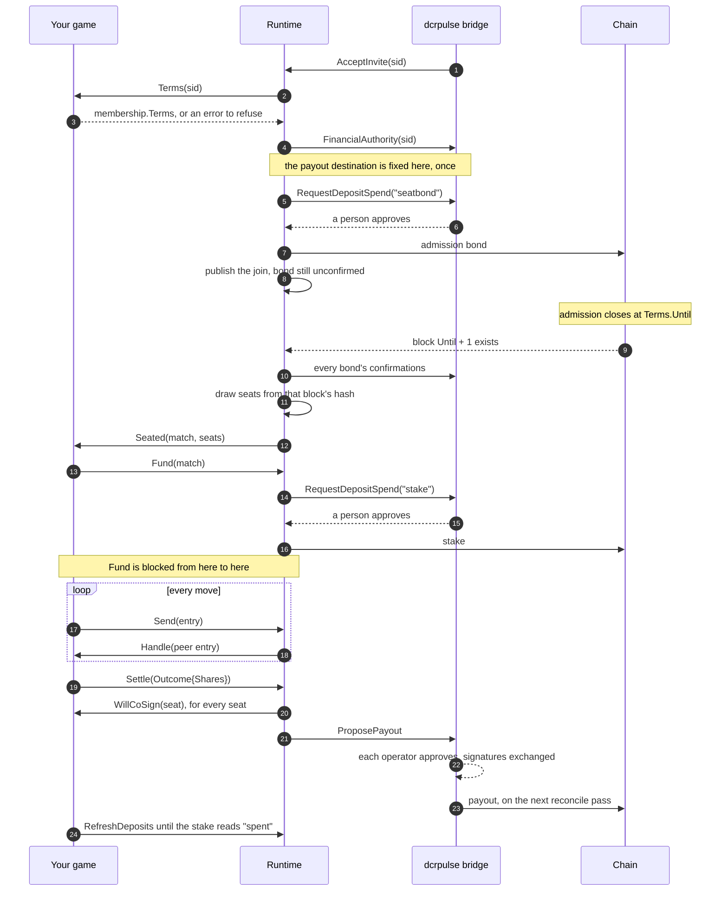

# Building a game on dcrgaming-sdk

You have a finished game - board, rules, turns, an interface, two players in a
session - and you want those players to stake real value on it. This is what you
have to write, and, more usefully, what you do not.

You should not need to read another game's source to follow this. If you do,
that is a bug in this document.

---

## What you are plugging into

A **dcrpulse gaming bridge** is somebody's own appliance. It holds the wallet
and the Bison Relay identity; your game holds neither and never will. Your game
runs wherever you like, dials the bridge, and asks it to move money. A person at
the dashboard approves every payment with their wallet passphrase.

That shape is the whole security model, and two consequences follow from it:

- **Your game cannot pay anybody.** It can only ask. If your design needs
  unattended payments, this is the wrong substrate.
- **Your game cannot be reached from outside.** It dials out; nothing dials in.
  No inbound port, no port forwarding, NAT is fine.

## The shape of a table

One table, end to end. Only the lines touching **Your game** are code you write;
the rest happens without being asked.



Two steps in there are the ones that catch people out. `Fund` does not return
until the stake is on the chain or the request dies, and the payout reaches the
chain on a reconcile pass rather than at the moment of approval.

## The three things you write

```go
type Rules interface {
	Identity() connect.Identity
	Terms(sid string) (membership.Terms, error)
	Handle(ctx context.Context, in Message) error
}
```

**`Identity`** - what your game is called and which version of its protocol it
speaks. The bridge routes on this and checks it rather than believing it.

**`Terms`** - what a table costs: buy-in, seats, refund timelock, bond, and the
height after which no more players are admitted. Return an error to refuse a
table you will not sit at.

**`Handle`** - one message addressed to your game. The runtime has already
framed it, routed it, reassembled it across chunks and checked the sender; the
body is whatever you put there and the runtime has not looked inside. Errors are
logged and the message dropped, deliberately: a runtime that retried on your
behalf would replay moves.

Three optional hooks. `Seated` says a table has finished forming. `CoSigning`
lets you refuse a payout. `Reporting` replaces the dashboard's status line for a
table; implement it only if the runtime's own - the table's lifecycle phase -
is not what you want an operator to read. The runtime fills the rest of the
dashboard itself.

`Seated` is not re-fired on restart, and forming is not funding: a seated table
has no stake in escrow yet. Wait for every seat's stake to read `verified`
before you treat a match as live.

**There is no hook for a payout landing.** Poll `RefreshDeposits` until this
seat's stake reads `Check == "spent"`; that is the only signal there is.

## The two things you tell the runtime

These are decisions only your rules can make, so they are calls you make rather
than methods you implement. There are two, and that is the whole list.

```go
game.Fund(ctx, match)                                                  // pay this seat's stake in
game.Settle(ctx, match, runtime.Outcome{Shares: map[uint32]int64{0: pot}})
```

**`Fund` blocks.** It writes the request down, asks the bridge, then polls every
three seconds until a person at the dashboard answers. It returns when the
payment is approved and its output is found, when the request reaches a terminal
state such as expired or rejected, or when your context ends. An unreachable
bridge is not an answer and does not end the wait.

Run it as a job. Do not call it from an HTTP handler, a UI callback, or anything
holding a short context or a lock: the context expires mid-approval and you are
left not knowing whether the money moved.

**An outcome** is shares, not a winner — a draw, a split pot and a three-way are
all outcomes, and `Void` unwinds a table by returning each seat its own stake.
The runtime does not check who won, because it cannot. It does check that the
shares name real seats and add up to exactly what the table holds, because a
settlement that does not add up is one the other seats refuse, and then
everybody's money waits out a refund timelock over an arithmetic mistake.

**Shares are gross.** Do not subtract the fee. The bridge deducts it downstream,
pro-rata across the positive payments; a caller that pre-subtracts it produces
an outcome that does not add up and cannot settle.

**`Settle` needs every seat.** Implement `runtime.CoSigning` and the runtime
asks before adding your signature to anything that pays another seat. One seat
refusing fails the whole call with `game has not verified this payout` — that is
the point, it is how a game says no with money rather than about it. Both peers
must also pass a byte-identical `Outcome`: the transaction bytes are fixed by
seat order, so two different share maps produce signatures that cannot be
combined. Compute the outcome once, store it, and pass that same value on every
retry.

## What you do not write

Not because it is provided as a convenience, but because writing it again is how
money gets lost:

- The bridge's control requests. There are three - `AcceptInvite`, `SetNames`
  and `RefreshState` - and the runtime answers them.
- The record of money in flight, and its persistence.
- Bison Relay framing, chunking and reassembly.
- Escrow scripts, bond scripts, addresses.
- Seat keys, log keys, forfeit keys.

What you also do not write, because it is not here at all: there is no
forfeiture execution, no claim ladder, no sweep, and no reclaim. Money that was
locked and never settled is recovered by its owner through dcrpulse, under
Gaming then Recovery, after the timelock matures. Your game has no part in it
and no API for it. If your design depends on taking money from a seat that
misbehaved, the only lever here is refusing to co-sign.

You should never type an HMAC tag, an escrow script or a gRPC call.

## Refusal is the only lever

Your game decides **that** a seat misbehaved. The runtime is never told which of
your rules was broken, and it has exactly one thing it can do about it: stop
co-signing.

Implement `runtime.CoSigning` and the runtime asks, once per seat, before adding
your signature to a spend that pays another seat. A game with nothing to say
does not implement it, and everything is co-signed.

**Withholding strands nothing.** Every pot the runtime builds has a branch its
owner can spend alone once the lock matures, so refusing to co-sign costs the
other side a wait and gains you nothing. That is exactly what makes it safe to
let a game decide, and it is why there is no need for the runtime to check your
reasoning.

That is the whole mechanism. A seat that cheats and then stops answering keeps
its own stake until the refund lock matures; there is no way to take it.

**Duty clocks are yours.** The runtime exposes the chain tip; deciding what a
seat owed and by when is game logic and stays with you. It does not keep your
log either - `pkg/gamelog` is a package you may use, not something the runtime
reads or replays on your behalf.

## The failure that costs money

If you read one thing here, read this.

There are two ways to fail to get a yes from the bridge, and they are not the
same:

- **The bridge answered no.** Terminal. The money did not move and never will.
- **You could not ask.** Not an answer. The bridge may have paid while your
  question was in flight - a restart of the bridge is exactly when that happens.

Treat the second as the first and you pay twice: the stake is paid, the game
stops watching, the interface still says it is owed, and it is paid again.

The runtime handles this for you. `spend.Unknown` is a state, not an error
return: a request in it stays open, is asked about again, and survives a restart
still open. Nothing can move a request out of open because a call failed.

If you ever find yourself writing a retry loop around a payment, stop — the
runtime already has one, and yours will not survive a restart. Worse, an outer
retry or your own dedup around `Fund` races the runtime's own single-flight and
you get `ambiguous obligation requires reconciliation`, which wedges the table
until somebody reconciles it by hand.

There is a third case, and it has its own error. `ErrUnresolvedPayment` means
the request went out and its id never came back. This is not "no" and it is not
"could not ask" — it is "nobody knows", and it is the one case the runtime will
not resolve on its own. Stop. Call `ReconcileSpend` with the bridge's request
id. Never call `Fund` again hoping.

```go
if err := game.Fund(ctx, match); errors.Is(err, runtime.ErrUnresolvedPayment) {
	// Surface it and stop. Do not retry; reconcile.
}
```

## When a table actually seats

Seats are drawn from a block hash, so a table cannot be seated until that block
exists. The block is `Terms.Until + 1` — the one *after* admission closes — and
every member derives it from the terms alone, so there is nothing to agree.

Two conditions, both required: the roster has agreed, and the chain has reached
that height. Whichever happens second is when seating happens, so an agreed
roster sitting idle for a block is normal, not a fault. If your test harness
mines its own blocks, mine past the deadline or nothing will ever seat.

Admission bonds are announced *unconfirmed*, deliberately: making confirmation
an admission condition would race a short registration window against the
confirmations themselves. Depth is checked later, as a readiness condition,
before the table is seated.

## Surviving a restart

`Seated` is not called again when your process comes back. `Persisting.LoadTable`
is, so that is where a game learns it is already seated.

The trap is on the way out. `Persisting.SaveTable` runs only when the runtime
itself reaches a lifecycle point — admission, a join, a roster commit, the
beacon, funding, settlement. **It never runs from `Rules.Handle`.** So a game
that keeps whose-turn-it-is by waiting for `SaveTable` silently loses every
mid-match write, even though the hook advertises itself as the place for exactly
that.

Keep your own journal for anything that changes during play, write it before you
sign rather than after, and replay it on the way back up.

## What the bridge host must have

Your game dials somebody else's appliance, so most of what can go wrong is on
their side and invisible from yours. The bridge answers every financial failure
with one string — `financial authority is unavailable` — and logs nothing, so
the error you get back does not distinguish these. Check them in this order.

- **dcrd runs with `txindex=1`.** Approving a payout does not broadcast it: a
  reconcile pass does, and it first looks the transaction up. Without the index
  that lookup fails in a way the bridge cannot read as "not found", so a payout
  signed by every seat is never sent. It sits at `publishing` indefinitely and
  says nothing.
- **dcrpulse opened the wallet itself.** Its open path short-circuits on a
  wallet another process already loaded, and then it never learns whether that
  wallet can sign — so it refuses every financial call. Run dcrwallet with
  `--noinitialload` and let dcrpulse open it.
- **The wallet has finished syncing.** Approving a spend before it has caught up
  returns an unknown broadcast outcome, which means reconcile, not retry.
- **The bound account is not a mixing account.** Funding change leaves a mixed
  account, and the spend is refused.
- **The Bison Relay identity is where dcrpulse looks for it.** Its RPC
  certificate path is fixed, not taken from the environment, and getting it
  wrong leaves the bridge with no identity and no obvious symptom.

None of it is yours to configure, but the symptom reaches your game as a
refusal, so check it before looking for the fault in your own code.

## Wiring it up

Three methods above, and this below. There is nothing else.

```go
rt, err := runtime.Open(runtime.Config{
	Rules:    game,
	Bridge:   bridge,           // dialled, and it has said hello
	Identity: seed,
	Dir:      dir,              // the runtime keeps its own records here
	SeatTags: identity.SeatTags{ // yours, frozen once chosen
		Session: "MyGame/session/v1",
		Log:     "MyGame/log/v1",
		Bond:    "MyGame/bond/v1",
	},
})
if err != nil {
	return err
}
defer rt.Close()

go rt.Run(ctx)
```

`Open` opens the spend book and the table store under `Dir`, builds the runtime
and reads back every table it had written down. The chain comes from the network
the bridge named in Hello, so there is no parameter to pass and no switch to
write; pass `Params` only when the bridge has not said hello, which in practice
means a test against a fake.

`Run` reads the chain tip on its own and moves every table on, so there is no
tick loop to write. A game with its own block feed sets `TickEvery: -1` and calls
`Tick` itself.

`Open` does not start `Run`, because a game that installs its own routes has to
do that first: Bison Relay replays history the moment you subscribe.

## Testing without a bridge

`pkg/gaming/bridgetest` is a bridge that only exists in your process. It speaks
the real protocol over real mTLS on a real socket, so your transport is exercised
rather than stubbed.

Use its failure injection, not just its happy path:

```go
fake.SetUnreachable(true)   // every call answers codes.Unavailable
fake.SetVerdict(bridgetest.Hold, "")    // a person has not decided yet
fake.SetVerdict(bridgetest.Refuse, "over the cap")
```

`example/` is a whole game wired to one of these - three methods, one `Open`,
and nothing else. `go run ./example` from the module root. It is built by CI, so
if the short path ever stops being short, the example says so first.


## The things you must not change

Some values in this module are frozen because live coin depends on them. They
look arbitrary. They are load-bearing.

- The proto package is `dcrpulse.gaming.v2`, baked into every gRPC path a live
  bridge routes on.
- A binary links this module's `gamingpb` **or** a vendored copy, never both.
  Double registration panics at init, before a single test runs.
- The domain-separation tags prefixed `dcrpoker/` and `gaming/table/` are frozen
  hash inputs. Never normalise them, however inconsistent they look: changing one
  invalidates live bonds, punishment keys and signed logs.
- `txscript/v4` and `wire` are pinned in `go.mod` and checked in CI. The escrow
  scripts build on those exact versions.
- `forfeit.Domain` is a closed allowlist of nine values. A game cannot add one:
  signing under an unknown domain is refused outright. Your game's own
  separation comes from `Config.SeatTags`, not from inventing a domain.
- `escrow.MaxMembers = 13` is a fact about the scripts - the redeem-script push
  limit, not a seat count anybody chose - and it is inherited by every game.

**Your own seat-key tags are yours to choose and yours to freeze.** You pass them
in `Config.SeatTags`; the SDK will not invent them, because they decide which
keys your seats have and changing one later strands whatever those keys held.
Pick them once, with a `/v1` suffix, and never touch them.

## What is not built yet

Honest state of the runtime, so you know what you would hit:

| Stage | State |
|---|---|
| connect, identify, dial | done |
| invite, terms, seating | done |
| funding an admission bond (`seatbond`) and a stake | done |
| settlement: propose and co-sign | done |
| settlement: assemble, sign, broadcast | **not here** - the bridge does this |
| learning that a payout landed | poll `RefreshDeposits` for `Check == "spent"` |
| reclaiming locked money | **not here** - dcrpulse, Gaming then Recovery |
| forfeiture of any kind | **not here** - refusing to co-sign is the only lever |

There are exactly two deposit purposes, `seatbond` and `stake`. There is no
table bond and no forfeitable bond; terms that ask for one are refused.

The runtime neither holds financial keys nor signs, assembles or broadcasts
payouts. It proposes and it co-signs; the bridge does the rest.

The full money path - bond, seat draw, stake, play, cooperative payout - runs
end to end against two independent wallets and two bridges on simnet. Treat
everything beyond that as code that passes its tests rather than code that has
been proven.

## Compatibility

The module is pre-1.0 and the runtime packages are new. Treat `pkg/runtime`,
`pkg/spend`, `pkg/gaming/connect` and `pkg/gaming/bridgetest` as
unstable until this section says otherwise.

The older packages - `escrow`, `forfeit`, `membership`, `gamelog`,
`gaming/{schema,wire,transport}` - carry live coin and change only additively.
`gamingpb` is not one of them: its proto major is part of every gRPC path, so a
game must be built against the same major as the bridge it dials. `membership.Terms` gained bond fields without moving the digest of
a table that states none, and that is the standard the rest is held to.

## Another language

The module is Go. If you are not, what you need is the protocol rather than the
library: the gRPC service in `pkg/gaming/gamingpb`, the frame format in
`pkg/gaming/wire`, the message envelope in `pkg/gaming/schema`, and the scripts
in `pkg/escrow`. All four are documented in their package comments, which are
long on purpose.

Be aware that you would be reimplementing the money-safety rules on this page,
including the one that cost 0.01 DCR.
