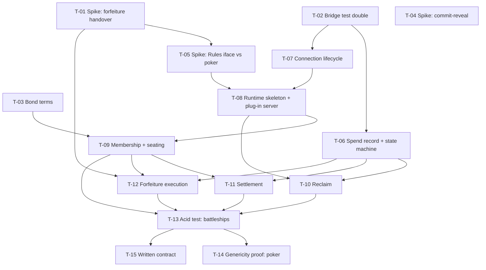

# Ticket Breakdown — the dcrgaming runtime

**Epic**: [dcrgaming-runtime.prd.md](../../dcrgaming-runtime.prd.md) ·
**Architecture**: [dcrgaming-runtime.architecture.md](../../dcrgaming-runtime.architecture.md)

> **Status 2026-08-19.** All fifteen tickets are done, and the breakdown missed
> five stages that were written as they surfaced: **T-16 funding**, **T-18
> settlement co-signing**, **T-20 the punishment-key exchange and sweep**,
> **T-21 the cooperative release**, and **T-22/23 the claim ladder with its
> answer and take**. T-13 and T-14 remain partial by design and their decision
> notes say exactly how. Nothing in the runtime returns ErrNotYet any more.
> The gap that is left is a mainnet run, not code.

## Epic summary

Move the money and lifecycle runtime into `dcrgaming-sdk` so a finished game adds dcrgaming
support by configuring the SDK rather than reimplementing escrow, seating, settlement,
forfeiture and reclaim. The runtime owns the loop; the game supplies identity and terms,
its own traffic, an outcome, and forfeiture rulings. Acid test: rebuild the battleships
daemon on the runtime and the residual game-owned code is its rules and nothing else.

**Standing constraints for every ticket**: own branch, never a mainline · no new module
dependencies · frozen warts hold (proto path, one `gamingpb` per binary, the 17 domain
tags, `txscript v4.1.1` / `wire v1.7.0` pins, `escrow.MaxMembers = 6`) · mainnet is the
test environment, no testnet stage · the SDK never rules on forfeiture.

---

## Tickets

### T-01 — Spike: the forfeiture handover contract
**One-way door. Gates T-05 and T-13.**

- **Scope**: define the ruling and evidence types the game hands the SDK. Prove they
  express battleships' three fates (sweep on equivocation, take on silence, attrition on
  an answered-out ladder) *and* poker's take/release, using both games' existing call sites
  as the test. Produces decided types plus a short decision note; no runtime wiring.
- **Decision rule**: one ruling type covering both with no game-specific branch inside the
  SDK → proceed. Either game needing the SDK to interpret its evidence → the boundary is
  wrong; move it toward the game and retry.
- **Context**: architecture §Spikes 1 · `dcrbattleships/pkg/punish` (`Sweep`, `Take`,
  `Attrition`, `Release`) · `dcrpoker/cmd/dcrpoker/{claim,take,release}.go` ·
  `sdk/pkg/forfeit` (`Branch`, `PunishmentKey`, `Recover`)
- **Files**: new `pkg/ruling/` (types + tests), decision note
- **Size**: ~500 lines · **Depends on**: none

### T-02 — Bridge test double as a supported artifact
**Infrastructure. Everything downstream tests against it.**

- **Scope**: one supported fake bridge replacing the three that exist privately today.
  Must support the money path (RequestSpend / SpendStatus / Broadcast / Outpoint /
  ChainTip / BlockHash), the frame path, and injectable failures — crucially an
  *unreachable* host, since that is the failure mode the runtime must survive.
- **AC**: battleships' `relayBridge` tests and poker's harness tests can both be expressed
  against it without either game adding a local double.
- **Context**: `dcrbattleships/cmd/dcrbattleshipsd/fakebridge_test.go` (`relayBridge`,
  `startRelay`, `place`) · `connect_test.go` (`fakeBridge`) · `money_test.go` (`fakeHost`) ·
  `dcrpoker/cmd/dcrpoker/{harness,hub}_test.go` · `sdk/pkg/gaming/transport`
- **Files**: new `pkg/gaming/bridgetest/`
- **Size**: ~900 lines · **Depends on**: none

### T-03 — Bond terms in the shared vocabulary
- **Scope**: `membership.Terms` is generic but carries no bond terms; battleships keeps
  `BondLockBlocks` in its own `match` package and poker has its own. Decide grow-vs-companion
  and land it, so a game declares stake and bond locks in one place.
- **AC**: both games' existing bond terms are expressible without a game-specific field.
- **Context**: architecture §Data model · `sdk/pkg/membership/messages.go:48` ·
  `dcrbattleships/pkg/match` · `sdk/pkg/escrow` (`MinBondAtoms`, `MinBondBlocks`)
- **Files**: `pkg/membership/messages.go` + tests
- **Size**: ~500 lines · **Depends on**: none

### T-04 — Spike: is commit-reveal a shared primitive?
- **Scope**: compare battleships' fleet commitment (`pkg/commitment`, 1,341 lines) against
  poker's card commitment for a common core. Decision only.
- **Decision rule**: a common core neither game has to bend to → it joins the SDK. Either
  bends → both keep their own.
- **Context**: architecture §Spikes 3 · `dcrbattleships/pkg/commitment` ·
  `dcrpoker/pkg/gaming/cardschema`
- **Files**: decision note only
- **Size**: ~200 lines · **Depends on**: none · **Deferrable** — affects scope at the margin

### T-05 — Spike: the `Rules` interface, designed against poker
**One-way door. The central new artifact.**

- **Scope**: sketch the interface a game implements, then port **poker's** seating and
  settlement call sites against it on a branch. Poker first, deliberately — designing
  against battleships and validating against battleships proves nothing.
- **Decision rule**: poker needs a method battleships does not → the interface is
  poker-shaped and the extra method is probably adjudication leaking in. Poker fits with no
  additions → commit the shape.
- **Context**: architecture §Recommended approach (the game supplies four things) ·
  `dcrpoker/cmd/dcrpoker/{tables,settle}.go` · T-01's ruling types
- **Files**: new `pkg/runtime/rules.go` + a throwaway poker branch
- **Size**: ~700 lines · **Depends on**: T-01

### T-06 — The spend record and its state machine
**The money core. The single highest-value ticket in the epic.**

- **Scope**: one record replacing the two incompatible `pendingSpend` types; the state
  machine with **unreachable-versus-refused as states, not as a remembered convention**;
  SDK-owned persistence following `pkg/identity`'s precedent (`0600`, temp-then-rename);
  the change events that feed the read projection; and the `Store` escape-hatch interface.
  Also resolve `transport.AwaitSpend`, which today returns on any error including
  unreachable.
- **AC**: a test fails if any money helper abandons an in-flight payment on an unreachable
  host. Both persistence modes exercised. Mutation-check the state machine.
- **Context**: architecture §Data model, §Boundaries · `dcrpoker/cmd/dcrpoker/spend.go:44`
  (record) and `:189-262` (the retry loop and its two comments recording a real 0.01 DCR
  double-payment) · `dcrbattleships/cmd/dcrbattleshipsd/spend.go:45,239` ·
  `sdk/pkg/gaming/transport/grpc_calls.go:121` · `sdk/pkg/identity/identity.go`
- **Files**: new `pkg/spend/`; touches `pkg/gaming/transport/grpc_calls.go`
- **Size**: ~1400 lines · **Depends on**: T-02

### T-07 — Connection lifecycle, headless
- **Scope**: config load/save, `stampGameIdentity`, dial, the `proveItWorks` probe,
  network-mismatch refusal, reconnect. **No wizard prompts and no console** — the SDK
  exposes config, validation and probe; the game decides how it collects input.
- **AC**: both games' connect behaviour is reproducible with no local connect code.
- **Context**: `connect.go` is already 91% identical between the two games (133 of 145
  lines) · `dcrpoker/cmd/dcrpoker/connect.go` · `dcrbattleships/.../connect.go` ·
  `sdk/pkg/gaming/transport` (`Dial`, `Hello`, `BridgeConfig`)
- **Files**: new `pkg/runtime/bridge.go` (or `pkg/gaming/bridge/`)
- **Size**: ~700 lines · **Depends on**: T-02

### T-08 — Runtime skeleton: the loop, the plug-in server, the read surface
**The spine. A slim end-to-end slice — later tickets fatten each stage.**

- **Scope**: the lifecycle loop that owns invite → seat → fund → settle → forfeit →
  reclaim with stages stubbed; the `Rules` wiring; the plug-in server for the bridge's five
  control requests (`AcceptInvite`, `Reclaim`, `SetPayout`, `SetNames`, `RefreshState`)
  including the request loop, reply marshalling and error-to-status mapping; and the
  **chain-tip and signed-log read surface** the game needs for its own duty clocks.
- **AC**: a trivial game implementing `Rules` connects, answers all five control requests
  and reaches a stubbed fund stage, with no dispatcher of its own.
- **Context**: architecture §Recommended approach, §Other calls (the read surface is public
  API — design it, don't let it leak) · `dcrpoker/cmd/dcrpoker/bridgereq.go:33,71` ·
  `dcrbattleships/.../bridgereq.go:30` · `sdk/pkg/gaming/gamingpb`
- **Files**: new `pkg/runtime/{loop,plugin,readsurface}.go`
- **Size**: ~1300 lines · **Depends on**: T-05, T-07

### T-09 — Membership and seating
- **Scope**: invite, accept, join, roster formation, terms agreement, match-id binding,
  names, payout address — as a state machine the runtime drives, on top of the existing
  `membership` primitives.
- **AC**: a game reaches a seated table supplying only terms; battleships' `acceptInvite` /
  `join` / `seatTable` / `setNames` / `setPayout` become unnecessary.
- **Context**: `sdk/pkg/membership` (`Formation`, `Terms`, `Bind`, `AddJoin`, `Agreed`) ·
  `dcrbattleships/.../tables.go` (`enroll`, `seatTable`) · `dcrpoker/.../tables.go`
- **Files**: new `pkg/runtime/table.go`, `pkg/runtime/seating.go`
- **Size**: ~1400 lines · **Depends on**: T-03, T-08

### T-10 — Reclaim and the sweeper
- **Scope**: the sweeper and the reclaim kinds, so locked funds return to the operator
  after a timelock with no game-specific code. Poker has three kinds (BOND, STAKE,
  TABLE_BOND); battleships fewer.
- **AC**: both games' reclaim paths expressible; a reclaim paying anywhere but the
  operator's own wallet is refused (bridge-side rule, mirrored in the runtime's shaping).
- **Context**: `dcrpoker/cmd/dcrpoker/reclaim.go` + `bridgereq.go:162-265` ·
  `dcrbattleships/.../reclaim.go` · `sweep` / `isSweeping` / `noteSweeping` /
  `doneSweeping` duplicated in both
- **Files**: new `pkg/runtime/reclaim.go`
- **Size**: ~900 lines · **Depends on**: T-06, T-08

### T-11 — Settlement
- **Scope**: propose, draft, co-sign, adopt, broadcast, and the backstop for a counterparty
  that stops answering. The game supplies an outcome; the runtime builds the payout.
- **AC**: `proposeSettlement` / `settleDraft` / `adoptSettlement` disappear from both games.
- **Context**: `dcrpoker/cmd/dcrpoker/settle.go` (893 lines, mainnet-proven — source of
  record) · `dcrbattleships/.../money.go` (`settleOutcome`, `settleWinner`, `bindOutcome`)
- **Files**: new `pkg/runtime/settle.go`
- **Size**: ~1200 lines · **Depends on**: T-06, T-09

### T-12 — Forfeiture execution
**Second one-way door: any change to bond scripts or punishment-key derivation invalidates
live bonds.**

- **Scope**: move `pkg/punish` and `pkg/evidence` into the SDK, cutting the two couplings
  first — `Attrition.Fate()` / `Outcome()` reach into battleships' spec-8.5 money matrix,
  and the ladder carries battleships' fee and depth constants. **`ShouldAccuse` does not
  move**: it is duty detection, and duty belongs to the game. Entry point is a T-01 ruling.
- **AC**: byte-identity on every script and key the move touches. The SDK contains no
  function that decides *whether* a seat forfeited.
- **Context**: architecture §Other calls · `dcrbattleships/pkg/punish` (`BuildLadder`,
  `CoSignAccuse`, `CoSignRelease`, `BackstopRelease`, `SweepForfeited`, `TakeExpired`,
  `AttritionBound`, `LadderDepth`) · `dcrbattleships/pkg/evidence` (`Open`, `Half`, `Store`)
  · `sdk/pkg/forfeit`
- **Files**: new `pkg/punish/`, `pkg/evidence/`; touches `dcrbattleships/pkg/match`
- **Size**: ~1400 lines · **Depends on**: T-01, T-06, T-09

### T-13 — Acid test: rebuild the battleships daemon on the runtime
**The epic's acceptance criterion.**

- **Scope**: rebuild `cmd/dcrbattleshipsd` against the runtime. Measure the residual.
- **AC**: game-owned code is `board`, `turns`, `phases`, its rules and its UI — and
  nothing else. Zero lines of spend book, bridge dispatcher, ladder, sweeper or seating
  machine. The developer never touches an HMAC tag, an escrow script or a gRPC call.
  Metrics from PRD §7 measured and recorded.
- **Context**: PRD §6 (the acid test) and §7 (metrics; baselines 2,078 money lines and
  ≈3,700 lifecycle lines) · the whole runtime
- **Files**: `dcrbattleships/cmd/dcrbattleshipsd/*` (large deletions)
- **Size**: ~1200 lines net, mostly removal · **Depends on**: T-09, T-10, T-11, T-12

### T-14 — Genericity proof: port poker on a branch, never deploy
- **Scope**: poker's real call sites compile against the runtime and its byte-identical
  goldens pass. **No live daemon adopts it.** Deployment stays a separate, later decision.
- **AC**: no game-specific branch inside the SDK was needed to express poker's behaviour;
  every golden passes; live daemons untouched. This is the PRD's wrong-condition, tested.
- **Context**: PRD §4 (wrong conditions) · architecture §Other calls · poker is pinned at
  v0.2.0, is not on a `replace`, and holds live coin · consumer goldens must keep running
  under poker's own module graph
- **Files**: `dcrpoker/cmd/dcrpoker/*` on a throwaway branch
- **Size**: ~1500 lines · **Depends on**: T-13

### T-15 — The written contract
- **Scope**: what a developer needs to go from a finished game to a funded table without
  reading dcrpoker — the four things a game supplies, the lifecycle, the failure modes that
  cost coin, and the published protocol to the standard where another language could
  reimplement it. Plus the compatibility promise (three tags in three days, one consumer
  pinned to the oldest, no policy).
- **AC**: someone who has not read dcrpoker can follow it end to end.
- **Context**: PRD §5 (JTBD, "give me the SDK") · architecture §Boundaries · the frozen
  warts, which a third party must not trip over
- **Files**: `README.md`, `docs/`
- **Size**: ~600 lines · **Depends on**: T-13

---

## Dependency graph

## Suggested execution order

**Wave 1 — parallel worktrees, no dependencies.** Spikes and infrastructure first: both
one-way doors get their decision before any API is committed.
`T-01` · `T-02` · `T-03` · `T-04`

**Wave 2 — parallel.**
`T-05` (after T-01) · `T-06` (after T-02) · `T-07` (after T-02)

**Wave 3.**
`T-08` (after T-05, T-07)

**Wave 4 — parallel.**
`T-09` (after T-03, T-08) · `T-10` (after T-06, T-08)

**Wave 5 — parallel.**
`T-11` (after T-06, T-09) · `T-12` (after T-01, T-06, T-09)

**Wave 6.**
`T-13` — the acid test, and the first honest read on whether the epic worked

**Wave 7 — parallel.**
`T-14` · `T-15`

### Notes on ordering

- **T-01 and T-05 are both one-way doors and both come first by design.** Committing an API
  shape before the forfeiture handover is settled is the single most expensive mistake
  available here.
- **T-06 can start in wave 2 even though the money core is the highest-value ticket** — it
  depends only on the test double, not on the `Rules` shape.
- **T-12 is gated on mainnet.** Per the architecture, forfeiture is not done until it has
  run on mainnet against a real refusing counterparty. That run is a follow-on to T-13, not
  part of T-12's merge gate.
- **T-14 is deliberately last and deliberately undeployed.** It proves genericity without
  exposing live bonds; whether poker's daemons ever adopt the runtime is a separate call.
- **Plan just-in-time**: only wave-1 tickets should be planned now. A dependent ticket
  waits until its dependency is *implemented*, because building it informs the plan.
